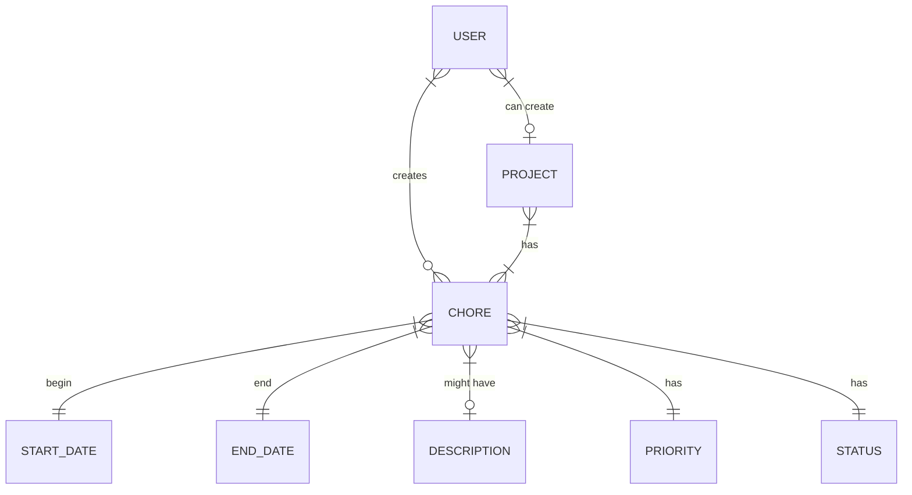
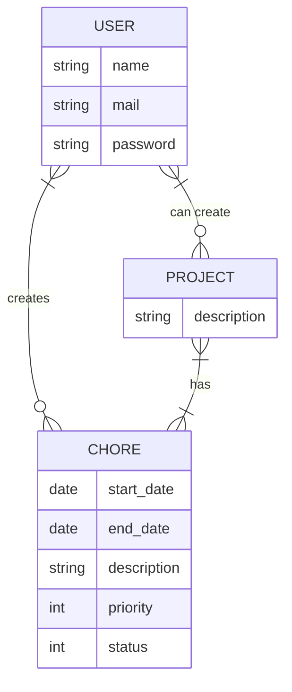

# todo List
This application is planed to rearange your chores and prioritize them so you can have a better track on your projects and everyday chores, eventually this app could grow to have a more Getting things Done oriented tool, yet this is just for having a visual tool for required chores.

# MoSCoW

## Must Have
 - Chore definition and creation
 - On project creation must include one or more Chores
 - Not all chores are Project Related
 - Can see priority on chores
 - Can see and update Status on chores
 - User can Create, update and Delete chores
 - Login and identification

## Should Have
 - Filtering by chore priority
 - User can Rearange chores on display

## Could Have
 - Description available with links and media
 - Planing tools for defining complexity on chores
 - Recurrent/Repeating Chores

## Will not Have
 - Chores to be visible to others
 - An agile oriented 

# Entity Relation Diagram

# Database definition Diagram

